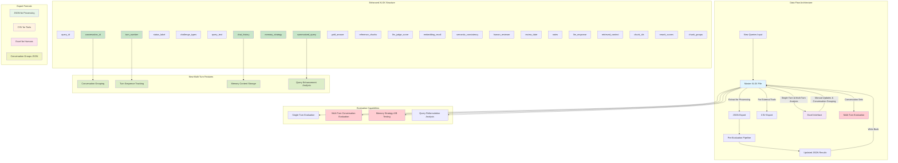

# RAG Data Flow

```mermaid
graph TB
    subgraph "Data Flow Architecture"
        A[New Queries Input] --> B[Master XLSX File]
        B --> |Extract for Processing| C[JSON Export]
        C --> D[Pre-Evaluation Pipeline]
        D --> E[Updated JSON Results]
        E --> |Write Back| B
        B --> |For External Tools| F[CSV Export]
        B --> |Single-Turn & Multi-Turn Analysis| G[Excel Interface]
        G --> |Manual Updates & Conversation Grouping| B
        B --> |Conversation Sets| H[Multi-Turn Evaluation]
    end

    subgraph "Enhanced XLSX Structure"
        I[query_id]
        NEW1[conversation_id]
        NEW2[turn_number]
        J[status_label]
        K[challenge_types]
        L[query_text]
        NEW3[chat_history]
        NEW4[memory_strategy]
        NEW5[summarized_query]
        M[gold_answer]
        N[reference_chunks]
        O[llm_judge_score]
        P[embedding_recall]
        Q[semantic_consistency]
        R[human_reviewer]
        S[review_date]
        T[notes]
        U[llm_response]
        V[retrieved_context]
        W[chunk_ids]
        X[rerank_scores]
        Y[chunk_groups]
    end

    subgraph "Evaluation Capabilities"
        Z1[Single-Turn Evaluation]
        Z2[Multi-Turn Conversation Evaluation]
        Z3[Memory Strategy A/B Testing]
        Z4[Query Reformulation Analysis]
        
        B --> Z1
        B --> Z2
        B --> Z3
        B --> Z4
    end

    subgraph "Export Formats"
        AA[JSON for Processing]
        BB[CSV for Tools]
        CC[Excel for Humans]
        DD[Conversation Groups JSON]
    end

    subgraph "New Multi-Turn Features"
        EE[Conversation Grouping]
        FF[Turn Sequence Tracking]
        GG[Memory Content Storage]
        HH[Query Enhancement Analysis]
        
        NEW1 --> EE
        NEW2 --> FF
        NEW3 --> GG
        NEW5 --> HH
    end

    style B fill:#e1f5fe
    style G fill:#f3e5f5
    style AA fill:#e8f5e8
    style BB fill:#fff3e0
    style CC fill:#fce4ec
    style DD fill:#f0f4c3
    style NEW1 fill:#c8e6c9
    style NEW2 fill:#c8e6c9
    style NEW3 fill:#c8e6c9
    style NEW4 fill:#c8e6c9
    style NEW5 fill:#c8e6c9
    style EE fill:#dcedc8
    style FF fill:#dcedc8
    style GG fill:#dcedc8
    style HH fill:#dcedc8
    style Z2 fill:#ffcdd2
    style Z3 fill:#ffcdd2
    style H fill:#ffcdd2

```
