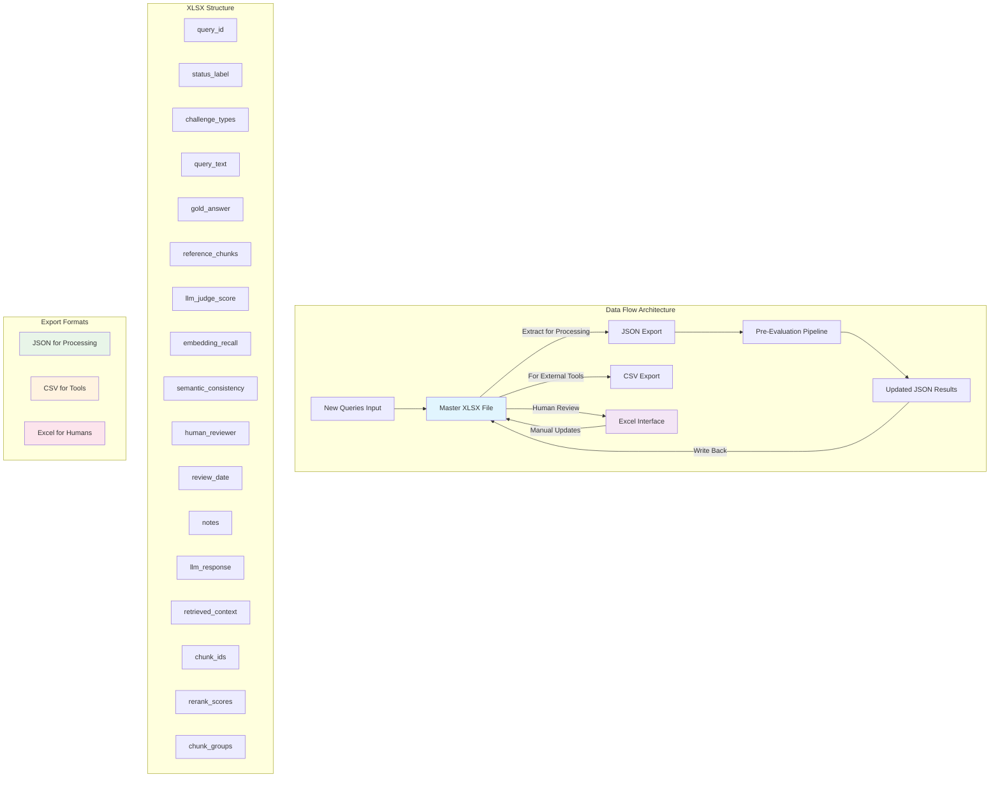

# RAG Data Flow

```mermaid
graph TB
    subgraph "Data Flow Architecture"
        A[New Queries Input] --> B[Master XLSX File]
        B --> |Extract for Processing| C[JSON Export]
        C --> D[Pre-Evaluation Pipeline]
        D --> E[Updated JSON Results]
        E --> |Write Back| B
        B --> |For External Tools| F[CSV Export]
        B --> |Human Review| G[Excel Interface]
        G --> |Manual Updates| B
    end

    subgraph "XLSX Structure"
        H[query_id]
        I[status_label]
        J[challenge_types]
        K[query_text]
        L[gold_answer]
        M[reference_chunks]
        N[llm_judge_score]
        O[embedding_recall]
        P[semantic_consistency]
        Q[human_reviewer]
        R[review_date]
        S[notes]
        T[llm_response]
        U[retrieved_context]
        V[chunk_ids]
        W[rerank_scores]
        X[chunk_groups]
    end

    subgraph "Export Formats"
        Y[JSON for Processing]
        Z[CSV for Tools]
        AA[Excel for Humans]
    end

    style B fill:#e1f5fe
    style G fill:#f3e5f5
    style Y fill:#e8f5e8
    style Z fill:#fff3e0
    style AA fill:#fce4ec

```
