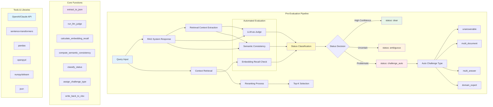

# RAG Pre-evaluation

```mermaid

graph TB
    subgraph "Pre-Evaluation Pipeline"
        A[Query Input] --> B[RAG System Response]
        B --> C[Retrieval Context Extraction]
        A --> D[Context Retrieval]
        D --> E[Reranking Process]
        E --> F[Top-K Selection]
        
        subgraph "Automated Evaluation"
            G[LLM-as-Judge]
            H[Embedding Recall Check]
            I[Semantic Consistency]
        end
        
        B --> G
        C --> G
        D --> H
        B --> I
        C --> I
        
        G --> J[Status Classification]
        H --> J
        I --> J
        
        J --> K{Status Decision}
        K --> |High Confidence| L[status: clear]
        K --> |Uncertain| M[status: ambiguous]
        K --> |Problematic| N[status: challenge_auto]
        
        N --> O[Auto Challenge Type]
        O --> P[unanswerable]
        O --> Q[multi_document]
        O --> R[multi_answer]
        O --> S[domain_expert]
    end

    subgraph "Core Functions"
        T[extract_to_json]
        U[run_llm_judge]
        V[calculate_embedding_recall]
        W[compute_semantic_consistency]
        X[classify_status]
        Y[assign_challenge_type]
        Z[write_back_to_xlsx]
    end

    subgraph "Tools & Libraries"
        AA[OpenAI/Claude API]
        BB[sentence-transformers]
        CC[pandas]
        DD[openpyxl]
        EE[numpy/sklearn]
        FF[json]
    end

    style A fill:#e3f2fd
    style J fill:#fff9c4
    style L fill:#e8f5e8
    style M fill:#fff3e0
    style N fill:#ffebee
    style T fill:#f3e5f5
    style AA fill:#e1f5fe

```
