# Pre-Evaluation Workflow

```mermaid
graph TD
    subgraph "Pre-Evaluation Workflow"
        A[Query Input] --> B[RAG System Response]
        
        subgraph "Evaluation Tools"
            G[LLM-as-Judge<br/>OpenAI/Claude API]
            H[Embedding Recall Check<br/>sentence-transformers]
            I[Semantic Consistency<br/>cosine similarity]
        end
        
        B --> G
        B --> H
        B --> I
        
        G --> J[Status Classification<br/>pandas logic]
        H --> J
        I --> J
        
        J --> K{Status Decision}
        K -.->|High Confidence| P[Auto-Processed Clear Queries]
        K -.->|Low Confednece| Q[Ambiguous Query Detection]
        K -.->|Mid Confednece<br/> -- Auto-Challenge| S[Challenge Type Assignment<br/>rule-based logic]    
        
        Q ==> T[Review Ambiguous Queries<br/>Excel interface]
        S ==> U[Confirm or Assign Challenge Types<br/>Excel interface]
        
        T -.->|Some become complex| U[Confirm or Assign Challenge Types<br/>Excel interface]
        
        T -.->|Some become clear| V[Add Gold Answers<br/>manual input]
        T -.->|Really bad<br/>after human checking| X[Keep for Future Review]
        
        V ==> W[Add Reference Chunks<br/>manual input]
        
        P ==> CLEAR[status: clear]
        W ==> CLEAR
        U ==> COMPLEX[status: Complex]
        X ==> AMBIGUOUS[status: Ambiguous]
    end
    
    %% Position final nodes at bottom
    CLEAR ~~~ COMPLEX ~~~ AMBIGUOUS
    
    %% Style final outcomes with traffic light colors
    style CLEAR fill:#90EE90,color:#000000,stroke:#2E8B57,stroke-width:3px
    style COMPLEX fill:#FFD700,color:#000000,stroke:#DAA520,stroke-width:3px
    style AMBIGUOUS fill:#FF6B6B,color:#000000,stroke:#CD5C5C,stroke-width:3px
    
    %% Style human tasks with blue
    style T fill:#87CEEB,stroke:#4682B4,color:#000000,stroke-width:2px
    style U fill:#87CEEB,stroke:#4682B4,color:#000000,stroke-width:2px
    style V fill:#87CEEB,stroke:#4682B4,color:#000000,stroke-width:2px
    style W fill:#87CEEB,stroke:#4682B4,color:#000000,stroke-width:2px
    
```

**Challenge Types Reference:**

- **unanswerable** - No answer exists in DB (trap query)
- **multi_document** - Requires combining multiple sources  
- **multi_answer** - Multiple valid answers exist
- **domain_expert** - Requires specialized knowledge

**Tools Description:**

- **LLM-as-Judge** - Nuanced evaluation using language models for accuracy and relevance
- **Embedding Recall Check** - Query-to-chunks similarity for retrieval quality
- **Semantic Consistency** - Response-to-context alignment using embeddings
