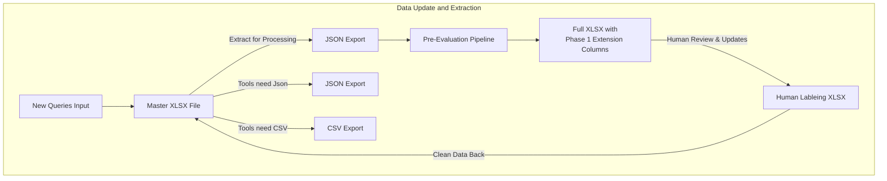

# Queries Flow



## Queries Layout

### XLSX Lifecycle Flow

- **Master XLSX Core Columns:** A-U  
- **Phase 1:** Add Chunk Text Columns V-BB  
- **Human Review:** Full text visible for labeling  
- **Phase 2:** Remove Chunk Columns  
- **Evaluation Tools:** Use `chunk_ids` only  

---

### Core Column Structure (A–U)

| Column | Name                | Description                                |
|--------|-------------------|--------------------------------------------|
| A      | query_id           | Unique identifier                          |
| B      | conversation_id    | Groups related queries                     |
| C      | turn_number        | Position in conversation                   |
| D      | status_label       | clear / ambiguous / challenge_auto         |
| E      | challenge_types    | unanswerable / multi_document / etc        |
| F      | query_text         | Original user question                     |
| G      | chat_history       | Previous conversation context              |
| H      | memory_strategy    | none / last_3_turns / summarized           |
| I      | summarized_query   | Context-enhanced query                     |
| J      | gold_answer        | Reference answer                           |
| K      | reference_chunks   | Gold standard chunk IDs                    |
| L      | llm_judge_score    | Automated quality score                    |
| M      | embedding_recall   | Retrieval quality metric                   |
| N      | semantic_consistency | Answer consistency score                |
| O      | human_reviewer     | Who reviewed this query                    |
| P      | review_date        | When reviewed                              |
| Q      | notes              | Human reviewer comments                    |
| R      | llm_response       | Generated answer                           |
| S      | chunk_groups       | Logical chunk groupings                    |
| T      | rerank_scores      | Relevance scores for all chunks            |
| U      | chunk_ids          | All retrieved chunk identifiers            |

---

### Phase 1 Extension Columns (V–BB, Variable Count)

| Column | Name                | Description                                 |
|--------|-------------------|---------------------------------------------|
| V      | retrieved_context_1 | Full text of chunk #1 (highest ranked)     |
| W      | retrieved_context_2 | Full text of chunk #2                        |
| X      | retrieved_context_3 | Full text of chunk #3                        |
| …      | …                   | …                                           |
| BB     | retrieved_context_N | Full text of chunk #N (where N = top_k)     |

---

### Implementation Strategy

#### Configuration-Driven Column Generation

```python
retrieval_config = {
    'top_k': 20,  # Creates retrieved_context_1 through retrieved_context_20
}

phase1_columns = base_columns + [f'retrieved_context_{i}' for i in range(1, top_k+1)]

