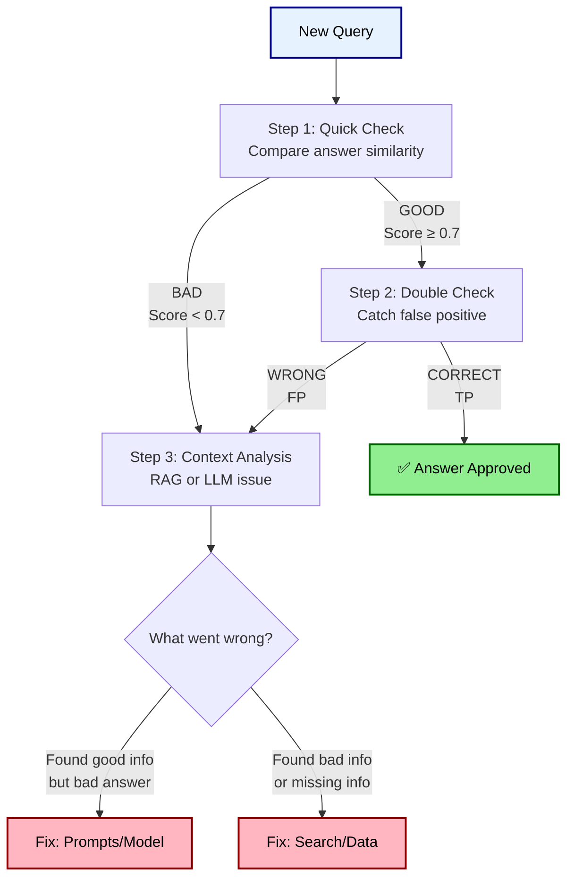

# Phase 2 - Real Evaluation

## How It Works

## Cost & Time Breakdown

| Step | Token Usage | Cost per Check | Time | When It Runs | How Often |
|------|-------------|---------------|------|--------------|-----------|
| Step 1: Quick Check | ~50 tokens | ~$0.0001 | 0.1s | Always | 100% |
| Step 2: Double Check | ~200 tokens | ~$0.004 | 3s | Step 1 passes | ~75% |
| Step 3: Context Analysis | ~5000 tokens | ~$0.1 | >3s | Either step fails | ~20% |

## What Each Step Does

### Step 1: Quick Check (Semantic Similarity)

- **What it does**: Compares your RAG answer to the correct answer using embeddings super fast and cheap
- **How fast**: Very fast screening in 0.1 seconds
- **What it catches**: Completely wrong or off-topic answers
- **What it misses**: Answers that sound right but have wrong facts

### Step 2: Double Check (LLM Answer Correctness)  

- **What it does**: AI compares RAG answer vs correct answer
- **Input**: Two short sentences to compare
- **What it catches**: False positive of Step 1.

### Step 3: Context Analysis (Context Recall + Precision)

- **What it does**: Checks top-10 retrieved chunks (500 tokens each = 5000 tokens)
- **Questions**: Did we find the right info? Is it relevant?
- **Result**: Tells you if problem is search or generation

## What Problems We Find

| What Happens | How Often | Why It Failed | What To Do | How To Fix Long-term |
|-------------|-----------|---------------|------------|---------------------|
| Step 1 ✅ + Step 2 ✅ | ~60% | System working | Nothing | Keep monitoring |
| Step 1 ✅ + Step 2 ❌ | ~15% | Sounded right but was wrong | Review manually | Adjust similarity threshold |
| Step 1 ❌ + Step 3: Bad Info | ~20% | Search found wrong stuff | Fix search/data | Better embeddings/chunking |
| Step 1 ❌ + Step 3: Good Info | ~15% | AI couldn't use good info | Fix prompts/model | Better instructions |

## What We DON'T Check (But Should Monitor Separately)

### 1. Generation Problems (Need Human Review)

- **Prompt issues**: Unclear instructions confusing the AI
- **Context problems**: AI ignoring parts of the information given
- **Model limits**: Tasks too hard for current AI model
- **Multi-document**: Can't combine info from multiple sources

### 2. Data Quality (Monitor in Data Pipeline)

- **OCR problems**: Scanned documents with errors
- **PDF parsing**: Text extraction failures  
- **Chunk quality**: Information split poorly
- **Index issues**: Search database problems

### 3. System Performance (Monitor in RAG System)

- **Speed**: How fast queries get answered
- **Errors**: Timeouts, API failures, crashes
- **Usage**: Token costs, rate limits, memory
- **Search quality**: Vector search accuracy over time

### 4. Business Context (Need Domain Experts)

- **Compliance**: Technically right but legally wrong
- **Strategy**: Accurate but bad business advice
- **Intent**: Right answer to wrong question
- **Timing**: Old information when current info needed
